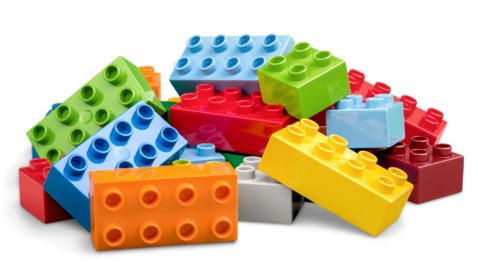
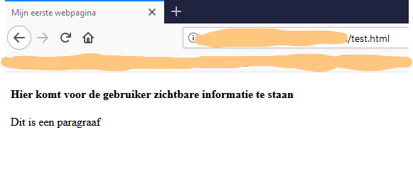
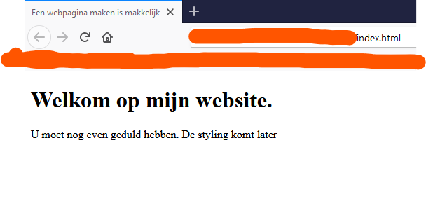

# FRONTEND-BASIC

## BASIS HTML-TAAK-02

### Wat is HTML

HTML staat voor Hyper Text Markup Language. Het is een opmaaktaal. Deze taal wordt uitgevoerd in de browser.

Een webpagina is opgebouwd uit HTML-tags. Tags kun je vergelijken met Lego blokjes. Net als bij Lego kun je hiermee de **STRUCTUUR** van een website bepalen.



De meeste webpagina's die jij gaat maken hebben een standaard patroon.

Een webpagina heeft vaak het volgende standaard patroon. Deze HTML-tags zijn **altijd** aanwezig op je website:

```html
<!DOCTYPE html>
<html>
  <head>
    <title></title>
  </head>
  <body></body>
</html>
```

Zoals je ziet komen de tags `2x` voor. Je ziet __openings-__ en __sluit-tags__.
De tags met een `/` ervoor zijn sluit tags. Dus bijvoorbeeld `</body>`. Dit betekent het **einde** van dit onderdeel.

> * `<!DOCTYPE html>` : tag die aangeeft dat je op deze pagina HTML versie 5 gebruikt
> * `<html>` : tag die aangeeft dat je html tags gaat gebruken
> * `<head>` : tag bevat informatie dat voor een normale gebruiker __niet zichtbaar__ is
> * `<title>` : tag waarin de titel van de webpagina genoteerd wordt
> * `<body>` : tag waar alle **zichtbare** informatie gezet wordt
> * Bijna alle tags hebben een sluit-tag:

```html
<html></html>
<head></head>
<title></title>
<body></body>
<h1></h1>
<p></p>
```

__Tussen__ de tags zet je informatie neer die daar hoort.

In de `<body>` tag zet je informatie neer waar je klant of gebruiker wat aan heeft. Tussen de `<h4>` tags zet je een titel neer. Tussen de `<p>`-tags zet je paragraaf tekst neer, net als bij een boek of krantenartikel. Bijvoorbeeld zo:

```html
<body>
  <h4>Hier komt voor de gebruiker zichtbare informatie te staan</h4>
  <p>Dit is een paragraaf</p>
</body>
```

Dit is dan het resultaat:


### OPDRACHT

1. Maak bij deze taak gebruik van bestand: `index.html`
2. Maak gebruik van de standaard tags en vul de volgende informatie in op de juiste plek, kies uit `title`, `h1` en `p` tags
   > - Een webpagina maken is makkelijk
   > - Welkom op mijn website.
   > - U moet nog even geduld hebben. De styling komt later
3. Lees de tekst en de opdracht goed om tot het eindresultaat te komen
4. Let erop dat de tag `title` tusse de `head` en de `</head>` tags komt te staan
5. Let erop dat de `h1` en `p` tags tussen de `<body>` en `</body>` tags komen te staan

### EINDRESULTAAT



### BRONNEN

- [W3Schools - HTML Tutorial](https://www.w3schools.com/html/)
