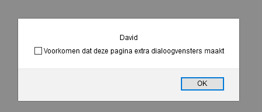

# FRONTEND-BASIC

## BASIS JAVASCRIPT-TAAK-03

### Variabelen 1

Je hebt bij de vorige opdracht code gemaakt dat een bepaalde __ouput__ genereerd. Je codeerde, afhankelijk van het type popup-box, een bepaalde __input__ van de gebruiker. Bij promp() kon de gebruiker naast Ok-knop ook iets invullen.

Maar met deze tekst input werd nog niks gedaan. Dat ga je bij deze opdracht coderen.

Om de input van zo'n _tekstveld_ te krijgen gebruiken we bij deze opdracht een __variabele__. Dat is een soort doosje waar je data in kan opslaan om later weer te gebruiken. In alle programmeertalen bestaan variabelen.

Het heet varaiabele omdat de inhoud kan veranderen. De inhoud varieert.

Om een variabele te maken gebruiken we uiteraard Javascript. De volgende schrijfwijze:

```html
<script>
    let mijnVoornaam = "David";
</script>
```

Zie dat het woordje `let` is gebruikt? Dit is het woordje waarmee je een variabele kunt maken.
Met deze code staat er `David` in de variabele `mijnVoornaam`. Je kunt ook zeggen: _mijnVoornaam bevat de waarde "David"_

Ook hier is een specifieke schrijfwijze gebruikt:

- `let` gebruiken we om te zeggen: dit is een __nieuwe__ variabele.
- de naam van de variabele begint met een kleine letter
- het tweede woord in een variabele is een hoofdletter __mijn`V`oornaam__
- een `=` teken wordt gebruikt om de variable te 'vullen'
- een woord of zin zet je tussen `"` en `"`
- een getal hoef je niet tussen aanhalingstekens te zetten
- een regel eindigt met een `;`

Leuk hoor zo'n variabele maar wat kun je ermee? Kijk eens naar de volgende twee voorbeelden.

```html
<script>
    let mijnVoornaam = "Homer";
    alert(mijnVoornaam);
</script>
```

```html
<script>
    alert("Homer");
</script>
```

In beide voorbeelden komt de naam Homer op het scherm via een alert()-box. Waarom gebruik je dan een variabele?

Het handige aan variabele is dat je data (gegevens) tijdelijk opslaat. Dus als het eenmaal is opgeslagen dan maakt het niet uit wanneer je het weer gaat gebruiken in je code. Check eens de volgende code

```html
<script>
    let prijsProduct = 399;
    let zomerKorting = 15; //percentages
    let ledenKorting = 10; //percentages
    let totaalPrijs = prijsProduct - (prijsProduct * ledenKorting /100) - (prijsProduct * zomerKorting/100);

    alert(totaalPrijs); // 229.25

</script>
```

De laatste regel is ontzettend ingewikkeld. Deze berekent blijkbaar een `totaalPrijs`. Zeg nou eens dat er schaarste ontstaat ivm leveringsproblemen vanuit China Het product wordt dus duurder. Maar de kortingen blijven staan. Het mooie van zo'n variabele is dat je alleen dat cijfer hoeft te veranderen en de code doet de rest. Kijk maar eens als we de prijs met 100 verhogen.

```html
<script>
    let prijsProduct = 499;
    let zomerKorting = 15; //percentages
    let ledenKorting = 10; //percentages
    let totaalPrijs = prijsProduct - (prijsProduct * ledenKorting /100) - (prijsProduct * zomerKorting/100);

    alert(totaalPrijs); // 374.25

</script>
```

### OPDRACHT

1. Open `index.html` in je browser.
2. Verander `prijsProduct` eens en kijk naar het resultaat.
3. Bestudeer de code eens.

### RESULTAAT


